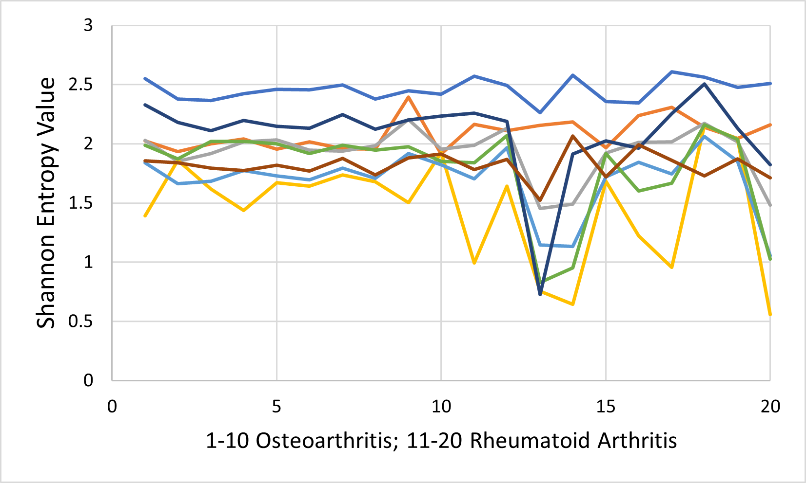
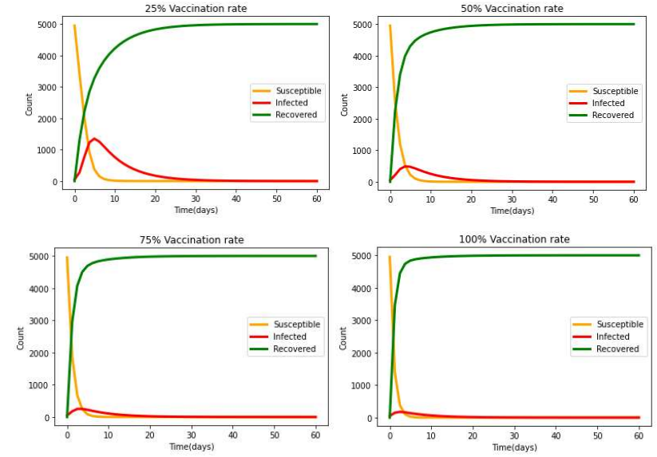

# Portfolio

<h3>Wavelet Packet Transform Analysis of NMR Spectroscopy Signals in Classifying Rheumatoid Arthritis and Osteoarthritis</h3>

<h3>Analysis of Deforestation and Flight Tracks of Lesser Spotted Eagles (Clanga pomarina) in Latvia using Computational Methods in MATLAB<h3>

<h3>SIR MODEL: A Theoretical Measles Outbreak with and without Vaccine Intervention<h3>

